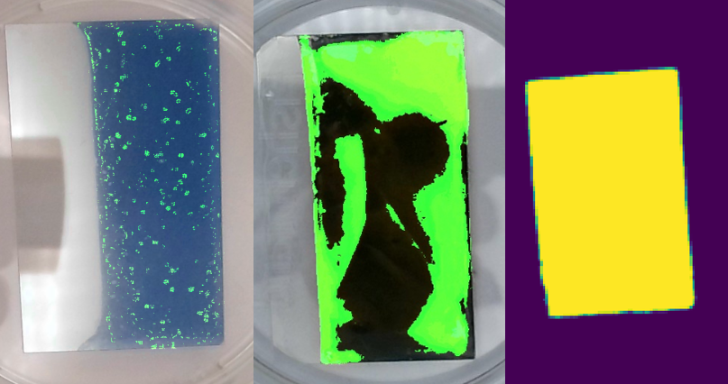
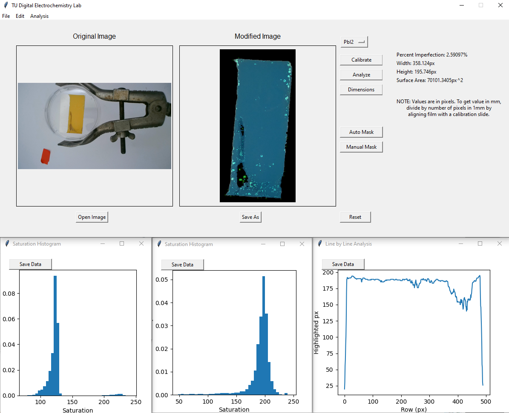

# TUDEL (TU Digital Electrochemistry Lab)

TUDEL is a photoanalysis toolkit for electrochemical films developed by Jack D.V. Carson for the Chemistry Summer Undergraduate Research Program (CSURP) at Tulsa University under an MIT License. 
It is intended for quick estimations of thickness, quality, and uniformity of basic solar-cell precursor films.

## Getting Started
### Easy Install (.exe)
- The easiest method of installation for people who are not interested in the source code is to download the most recent .exe file under the releases tab.
- As of version 0.4, there is no installer, so Windows will wisely warn you about the dangers of executables.
- The compiled .exe can run immediately with no other dependencies.

For those that are weary of executables, I recommend the following build process.

### Build TUDEL from Source

#### Dependencies
- Python >3.8
- NumPy
- OpenCV-Python
- Matplotlib
- Tkinter
- PIL

#### Download
- Git clone the repository onto your machine
  - If you do not have git installed or do not know how to use it, this will not serve as a tutorial. Download the git terminal [here](https://git-scm.com/). Read more about how to clone a repository [here](https://github.com/git-guides/git-clone)
- `cd` into the new directory with `cd Electrodeposition_analysis`
- Install dependencies with `pip3 install -r requirements.txt`
  - If you encounter an ImportError after this, manually `pip3 install opencv-python`
- Run the application with `python3 application.py`
  - It is also possible to right click the `application.py` file and `open with > python` 

### Usage
As of V0.4, the CLI is deprecated and the GUI is the preferable method for usage. After opening the window,
simply:
1. press Open Image and select a file
2. Choose the type of film you wish to analyze from the new dropdown menu
3. Select your operation from the buttons on the left (calibrate, analyze, dimension), and the results should quickly appear
   1. It is advisable to calibrate the image before usage to ensure brightness and color quality are consistent
4. Save the analyzed image with the Save Image button

## Version History
- V0.5 Advanced analysis and tuning
- V0.4 Graphical User Interface
- V0.3 Documentation and CLI interface
- V0.2 Fixed Sobel edge bug and major refactoring
- V0.1 Initial Commit

## Capabilities
- Measuring dimensions and area of films
- Measuring film uniformity/quality of electrodeposition
- Estimating thickness < 1 micrometer
- Calibrating film images
- Change in deposition area
- Quantifying deposition quality
- Analyzing degradation of Perovskites 

## Acknowledgements

A special thanks to Dr. LeBlanc and the LeBlanc research group for mentorship and guidance in the creation of this software 
as well as the CSURP program and the University of Tulsa.